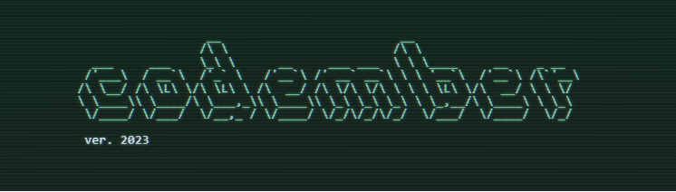
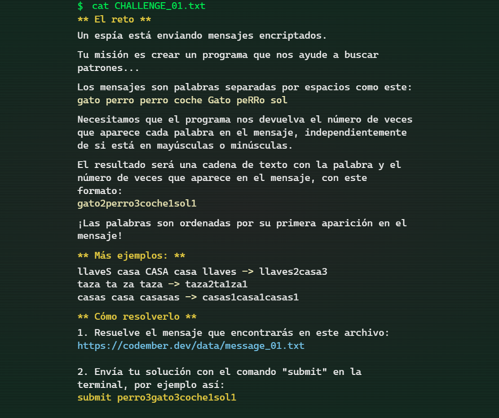
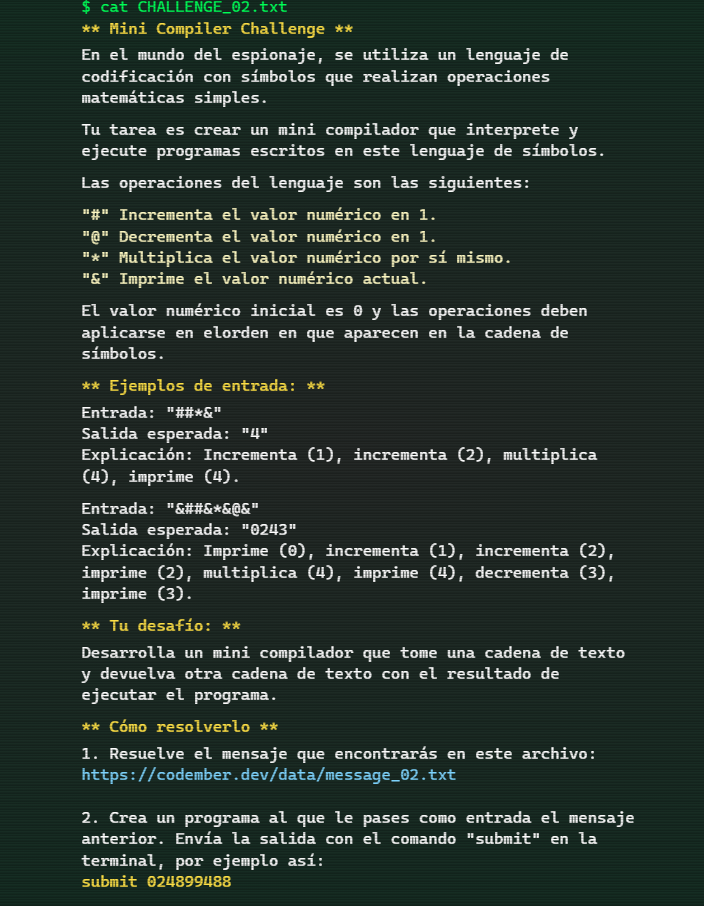
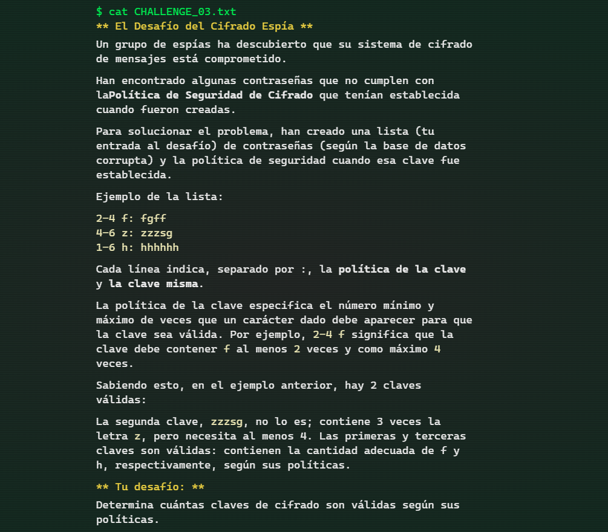
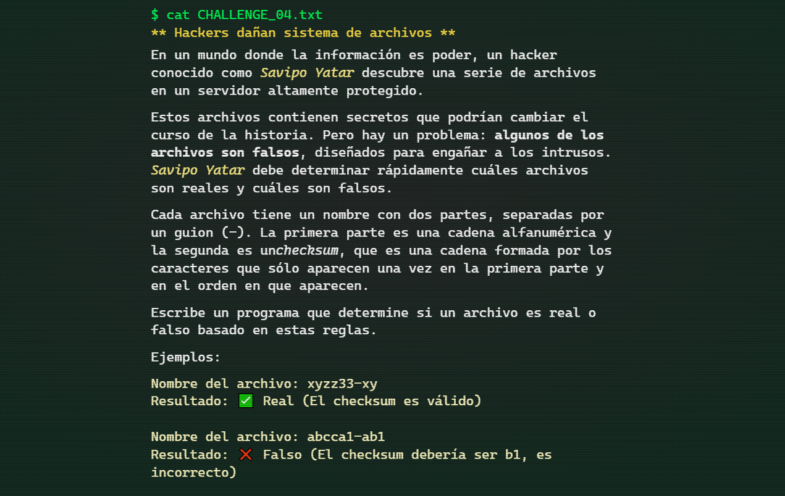
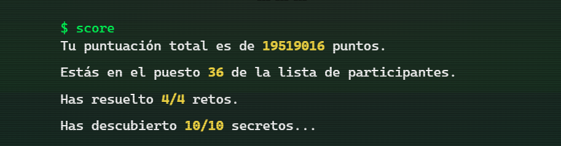

## Retos Codember2023 🎯

##  [Codember](https://codember.dev/) es una iniciativa de [@midudev](https://midu.dev/)

## Retos 🎯

|                                    Img                                    | Reto |                                Título                                |           Descripción           |            Solución            |
| :-----------------------------------------------------------------------: | :--: | :------------------------------------------------------------------: | :-----------------------------: | :----------------------------: |
|  | #01  | [Un espía está enviando mensajes encriptados](https://codember.dev/) | [Ver](./CHALLENGE_01/README.md) | [Ver](./CHALLENGE_01/index.js) |
|  | #02  |               [Mini compilador](https://codember.dev/)               | [Ver](./CHALLENGE_02/README.md) | [Ver](./CHALLENGE_02/index.js) |
|  | #03  |                [Nos hackearon](https://codember.dev/)                | [Ver](./CHALLENGE_03/README.md) | [Ver](./CHALLENGE_03/index.js) |
|  | #04  |      [Hackers dañan sistema de archivos](https://codember.dev/)      | [Ver](./CHALLENGE_04/README.md) | [Ver](./CHALLENGE_04/index.js) |

## Puntuación 🙌

## Secretos 🤫

    
📷 Imagen pixelada

    <ul>
        <code> $ submit Rauch </code>
    </ul>

    
📅 Correo

    <ul>
        <code> $ submit 2023-12-01 </code>
    </ul>

    
🎮 Código Konami

    
 Presiona: UP, UP, DOWN, DOWN, LEFT, RIGHT, LEFT, RIGHT, B, and A 

    
🤔 Adivinanza (Soy un caballero elegante...)

    <ul>
        <code> $ submit HTML </code>
    </ul>

    
🧙‍♀️ Palabra más famosa del mundo

        <ul>
            <li>
                <code> $ abracadabra </code>
            </li>
            <li>
                <code> $ submit itsmagic </code>
            </li>
        </ul>

    
🎊 Prueba a lanzar confetti

        <ul>
            <code> $ confetti </code>
        </ul>

    
🙈 Ten cuidado, y no hagas un giro de barril...

        <ul>
            <code> $ do a barrel roll </code>
        </ul>

    
🔐 Tsk, tsk. ¿Has hecho el último reto?...

        <ul>
            <li><code> $ sudo nljzuyfzb</code></li>
            <li><code> $ cd private</code></li>
            <li><code> $ cat ai.webp</code></li>
            <li><code> $ submit Altman</code></li>
        </ul>

    
👨‍🚀 El astronauta perdido...

        <ul>
            <li><code> $ sudo nljzuyfzb</code></li>
            <li><code> $ cd private</code></li>
            <li><code> $ cat log_mars_mission.txt</code></li>
            <li><code> $ submit majortom</code></li>
        </ul>

    
🐮 Muuuuuuuuuu...

        <ul>
            <li><code> $ mail 4</code></li>
            <li><code> $ cowsay</code></li>
            <li><code> $ ping midu.dev</code></li>
        </ul>

