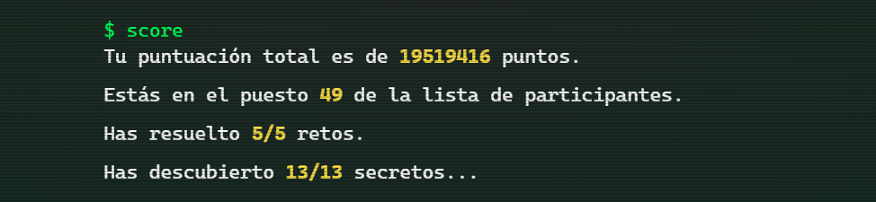

## Retos Codember2023 🎯 

##  [Codember](https://codember.dev/) es una iniciativa de [@midudev](https://midu.dev/)

## Retos 🎯 

|                                    Img                                    | Reto |                                Título                                |           Descripción           |            Solución            |
| :-----------------------------------------------------------------------: | :--: | :------------------------------------------------------------------: | :-----------------------------: | :----------------------------: |
|  | #01  | [Un espía está enviando mensajes encriptados](https://codember.dev/) | [Ver](./CHALLENGE_01/README.md) | [Ver](./CHALLENGE_01/index.js) |
|  | #02  |               [Mini compilador](https://codember.dev/)               | [Ver](./CHALLENGE_02/README.md) | [Ver](./CHALLENGE_02/index.js) |

## Puntuación 🙌 

## Secretos 🤫

    
Imagen pixelada

    <code> $ submit Rauch </code>

    
Correo

    <ul>
        <li>
            <code> $ mail 1 </code>
        </li>
        <li>
            <code> $ cal </code>
        </li>
        <li>
            <code> $ submit 2023-12-01 </code>
        </li>
    </ul>

    
Código Konami

    
 Presiona: UP, UP, DOWN, DOWN, LEFT, RIGHT, LEFT, RIGHT, B, and A 

    
Adivinanza (Soy un caballero elegante...)

    <li>
            <code> $ submit HTML </code>
        </li>

